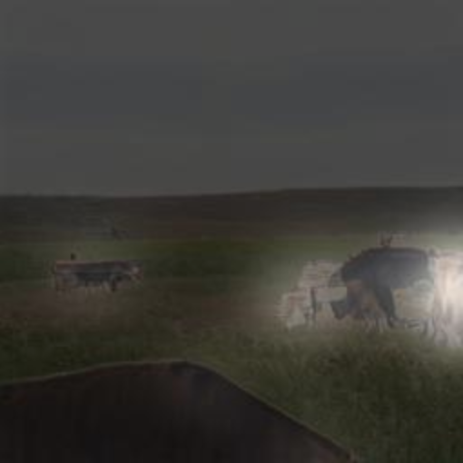

# Controllable Text-to-Image Generation

## Text to Image --- the Task

The task we focus on is the text to image generation. In this task, we want the model to generate realistic images that semantically match given text descriptions. We built a mobile app as the frontend and started a server based on the ControlGan model as the backend.


## Deliverables
* React-Native App
* [One archive file containing source codes and datasets for training and deploying as the backend](https://drive.google.com/file/d/1UTAmiyOG96Nx9Kreh4E_n1UA_qfb9q9S/view?usp=sharing)
* [One Docker image ready to deploy](https://hub.docker.com/repository/docker/mayukuner/text2img)
* [One Dockerfile](Dockerfile)


## Backbone Model
Here we use ControlGan as our backbone network to generate high-quality and controllable images from user inputs. The structure of ControlGAN is as follows.


### Pretrained models

#### Pretrained DAMSM Model
- [DAMSM for bird](https://drive.google.com/file/d/1dbdCgaYr3z80OVvISTbScSy5eOSqJVxv/view?usp=sharing). Download and save it to `DAMSMencoders/`
- [DAMSM for coco](https://drive.google.com/file/d/1k8FsZFQrrye4Ght1IVeuphFMhgFwOxTx/view?usp=sharing). Download and save it to `DAMSMencoders/`

#### Pretrained ControlGAN Model
- [ControlGAN for bird](https://drive.google.com/file/d/1g1Kx5-hUXfJOGlw2YK3oVa5C9IoQpnA_/view?usp=sharing). Download and save it to `models/`
- [ControlGAN for coco](https://drive.google.com/file/d/1Id5AMUFngoZ9Aj-EhMuc590Sv8E3tXjX/view?usp=sharing). Download and save it to `models/`


### Training Phase

To train a ControlGAN, before execute the orders in the instructions below, you should unzip the archive file and then enter the folder `code`.

#### [DAMSM](https://github.com/taoxugit/AttnGAN) model includes text encoder and image encoder
- Pre-train DAMSM model for bird dataset:
```
python pretrain_DAMSM.py --cfg cfg/DAMSM/bird.yml --gpu 0
```
- Pre-train DAMSM model for coco dataset: 
```
python pretrain_DAMSM.py --cfg cfg/DAMSM/coco.yml --gpu 0
```
#### ControlGAN model 
- Train ControlGAN model for bird dataset:
```
python main.py --cfg cfg/train_bird.yml --gpu 0
```
- Train ControlGAN model for coco dataset: 
```
python main.py --cfg cfg/train_coco.yml --gpu 0
```

`*.yml` files include configuration for training and testing.


### Testing Phase

- Test ControlGAN model for bird dataset:
```
python main.py --cfg cfg/eval_bird.yml --gpu 0
```
- Test ControlGAN model for coco dataset: 
```
python main.py --cfg cfg/eval_coco.yml --gpu 0
```


## Text To Image --- The App

### Server side

The backend server can be set up on any computer with at least one GPU on it. First, you should use docker to pull down the docker image:

```
docker pull mayukuner/text2img
```

and then run the docker image by:

```
docker run --gpus all -p 5000:5000 mayukuner/text2img
```

Please note, you could also use Dockerfile to build the docker image. But before doing this, you will have to download the zip file from link provided in [download_code_and_data.txt](download_code_and_data.txt).

Then the server will be successfully set up. The address will be 

```
localhost:5000
```

To get the specific output image from one sentence, you could send a GET request with 3 parameters to the server as:

```
localhost:5000/generate?dataset=<dataset>&sentence=<sentence>&highlight=<word>
```

|           | definition                                                                     | example                                      |
|-----------|--------------------------------------------------------------------------------|----------------------------------------------|
| sentence  | The sentence to generate the image                                             | a herd of cows that are grazing on the grass |
| dataset   | The dataset that the model is trained on                                       | COCO                                         |
| highlight | The highlighted word whose attention  map will be masked on the original image | herd                                         |


The server will respond with a JsonResponse in the form of:

```
{
    “image_url”: <image_url>
}
```

where the variable `<image_url>` indicates the url to the generated image. By further requesting the image file by `<image_url>`, we will get the generated image.

The corresponding output for the example input in the above table is:




### Demo


## Reference

- Lee, Minhyeok, and Junhee Seok. "Controllable generative adversarial network." IEEE Access 7 (2019): 28158-28169.
- Xu, Tao, et al. "Attngan: Fine-grained text to image generation with attentional generative adversarial networks." Proceedings of the IEEE conference on computer vision and pattern recognition. 2018.

## Links
- [ControlGAN](https://github.com/mrlibw/ControlGAN)
- [AttnGAN](https://github.com/taoxugit/AttnGAN)